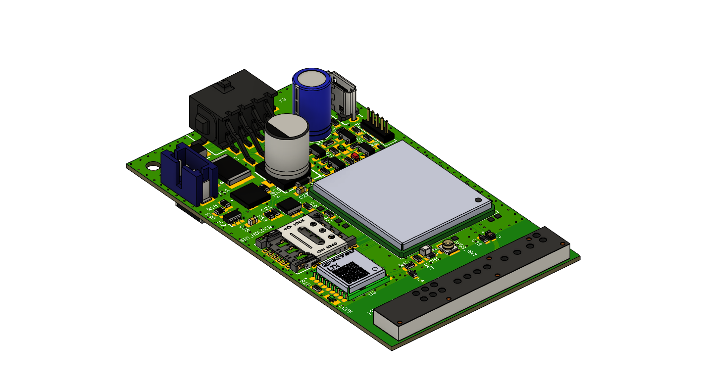
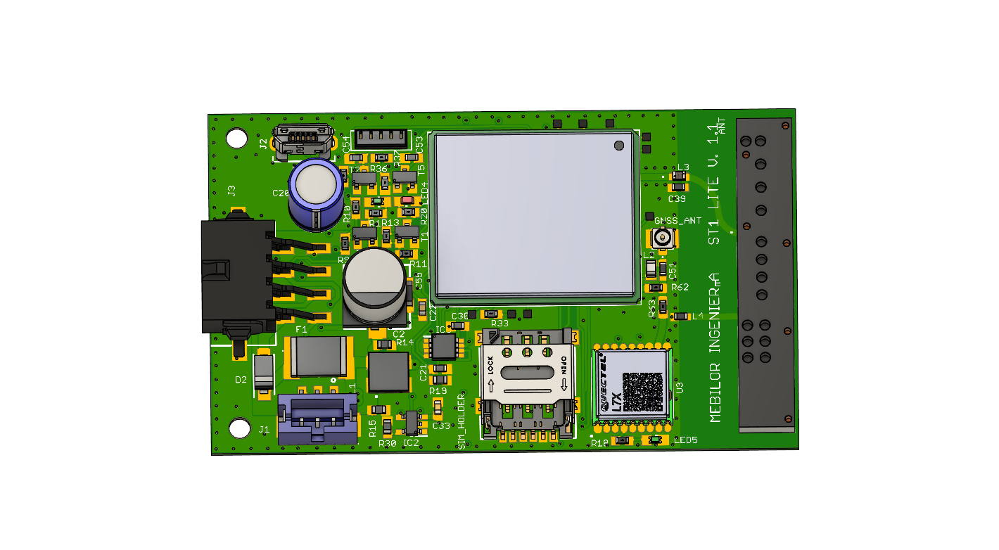
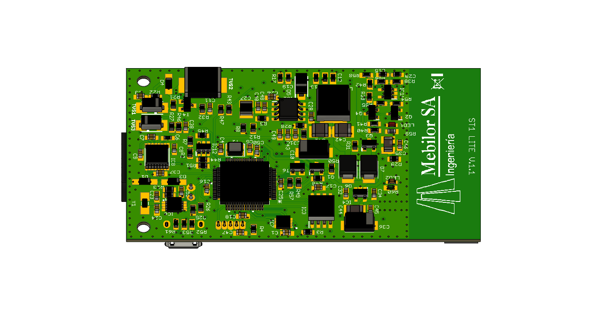
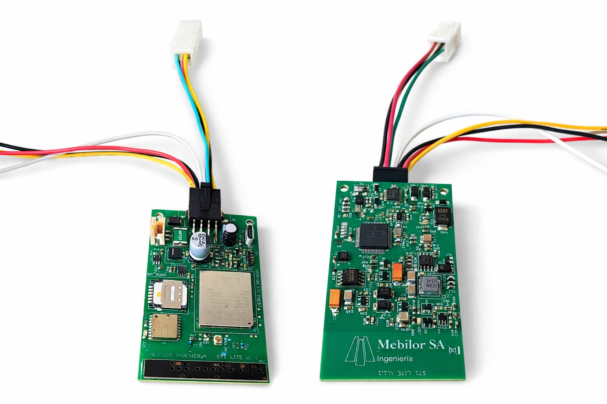
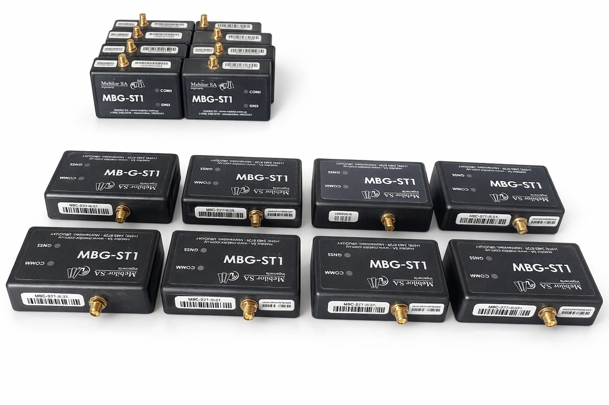
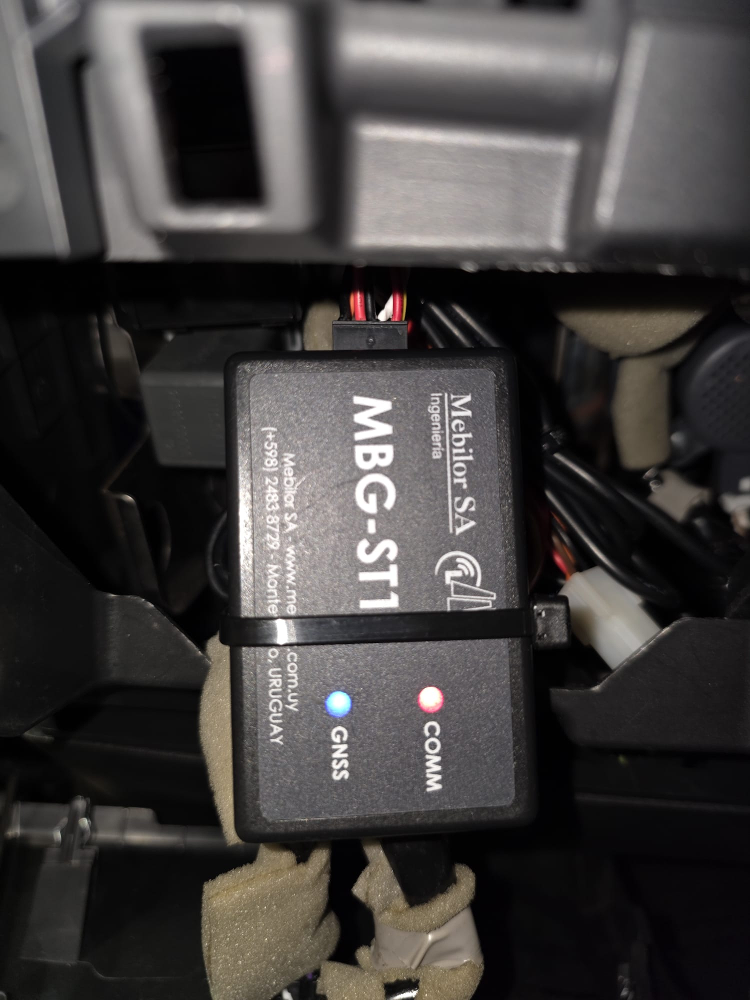

# 🚛 Industrial Automotive Telematics Gateway

## Project Overview
This project is a high-end Industrial IoT Gateway for vehicle telematics. It is designed to bridge the gap between heavy-duty and light-duty vehicles ECUs and cloud analytics, featuring a robust architecture for data persistence, remote management, and high-precision tracking.

## 🛠️ Advanced Engineering Features

### 1. Industrial-Grade Hardware Design
* **The Challenge:** Automotive environments are harsh (voltage spikes, extreme temperatures, and vibration).
* **The Solution:** Designed hardware to handle Load Dumps. Optimized the layout for thermal stability and vibration resistance using automotive-grade components. High efficiency switched DC/DC power source with termal management on PCB. 

### 3. Robust Data Persistence & Offline Mode
* **The Challenge:** Maintaining data integrity during long-haul trips through areas with zero cellular coverage.
* **The Solution:** Implemented an internal **Non-Volatile Memory buffer**. The firmware manages a "Store and Forward" logic, logging all events with millisecond precision using a dedicated **RTCC (Real-Time Clock Calendar)** and transmitting them automatically once LTE-CatM1 connectivity is restored.

### 4. Edge Intelligence & Diagnostics
* **Communication Datalogging:** Developed a comprehensive internal logger for all MCU-to-Modems commands and responses, facilitating rapid debugging and system health monitoring in the field.

### 5. Remote Management
* * **Firmware Over-The-Air:** The system architecture supports **FOTA updates**, allowing for remote feature deployment and security patching without physical vehicle access, significantly reducing maintenance Opex.

## 📋 Detailed Hardware Specifications

| Component | Technical Details |
| **Connectivity** | LTE Modem |
| **GNSS** | High-sensitivity engine for precise positioning & speed tracking |
| **Vehicle Interface** | Isolated CAN Bus + Multi-channel I/O (Analog & Digital) |
| **Power System** | Li-Ion Battery Backup + Smart Charging Circuitry | 
| **Interfaces** | **UART** for local configuration and diagnostics |
| **Sensors** | 3-Axis Accelerometer + RTCC for time-stamping |
| **Energy Management** | Advanced Power Save Modes (PSM) for minimal vehicle battery drain |

## 📸 Hardware Showcase

[⬅ Back to Main Portfolio](https://github.com/aleromio)
